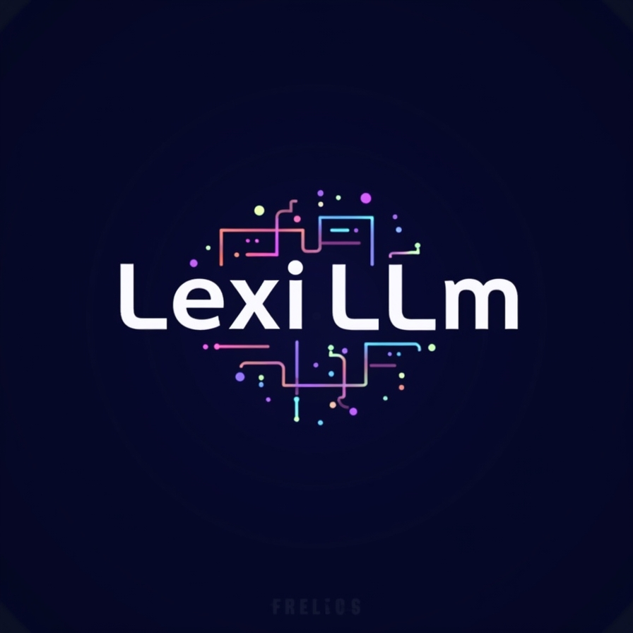

# LexiLLM: Your LLM Expert Assistant

LexiLLM is a specialized chatbot designed to assist with understanding and implementing Large Language Models. It provides expert guidance on LLM fundamentals, implementation strategies, model comparisons, and the latest trends in the field.



## Features

- 🧠 **LLM Fundamentals**: Explanations of transformer architecture, embeddings, attention mechanisms, and core concepts
- ⚙️ **Implementation Guidance**: Advice on fine-tuning, RAG, reducing hallucinations, and deployment
- ⚖️ **Model Comparisons**: Objective analysis of different LLM models like GPT-4, Claude, and Llama
- 📰 **News & Trends**: Updates on the latest research, applications, and developments
- 👤 **Personalized Responses**: Information collection to tailor responses to your background and needs
- 🔄 **Streaming Responses**: Real-time, token-by-token response generation
- 💾 **User Profile Management**: Persistent user profiles across sessions

## Installation

### Prerequisites
- Python 3.10+
- OpenAI API key

### Setup

1. Clone the repository:
   ```bash
   git clone https://github.com/yourusername/lexillm.git
   cd lexillm
   ```

2. Create and activate a virtual environment:
   ```bash
   python -m venv .venv
   source .venv/bin/activate  # On Windows: .venv\Scripts\activate
   ```

3. Install the dependencies:
   ```bash
   pip install -r requirements.txt
   ```

4. Create a `.env` file with your OpenAI API key:
   ```
   OPENAI_API_KEY=your_api_key_here
   ```

## Usage

### Command Line Interface

Run the CLI version:

```bash
./run.sh
```

Or with streaming enabled:

```bash
USE_STREAMING=true ./run.sh
```

### Streamlit Web Interface

Run the enhanced Streamlit UI:

```bash
./run_enhanced_ui.sh
```

### Example Interactions

```
LexiLLM: Welcome to LexiLLM! I'm your specialized assistant for Large Language Models. How can I help you today?

You: How do transformer models work?

LexiLLM: [Detailed explanation about transformer architecture...]
```

## Project Structure

```
LexiLLM/
├── assets/               # Images and static files
├── presentation/         # Project presentation materials
├── src/                  # Source code
│   ├── lexillm/          # Core LexiLLM package
│   │   ├── core/         # Core implementation
│   │   ├── modules/      # Functional modules
│   │   └── ...           # Other components
│   ├── ui/               # UI components
│   ├── main.py           # CLI entry point
│   └── ui_streamlit_enhanced.py  # Web UI entry point
├── tests/                # Test suite
├── user_profiles/        # Saved user profiles
├── .env                  # Environment variables
├── requirements.txt      # Dependencies
└── run.sh, run_enhanced_ui.sh, run_tests.sh  # Helper scripts
```

## Technologies Used

- **LangChain**: For LLM orchestration and chaining
- **OpenAI API**: For GPT model access
- **Streamlit**: For web interface
- **Pydantic**: For data validation
- **Python Dataclasses**: For structured data representation
- **Dotenv**: For environment variable management

## Testing

Run the test suite:

```bash
./run_tests.sh
```

## Future Improvements

- Expanding the knowledge base with more specialized LLM topics
- Adding visualization tools for LLM concepts
- Supporting more LLM providers beyond OpenAI
- Implementing a memory system for longer conversations
- Adding export functionality for conversation summaries

## License

This project is licensed under the MIT License - see the LICENSE file for details.

## Contact

Uday Kiran Dasari - uday.kiran.dasari@example.com

Northeastern University - Prompt Engineering - Spring 2025
