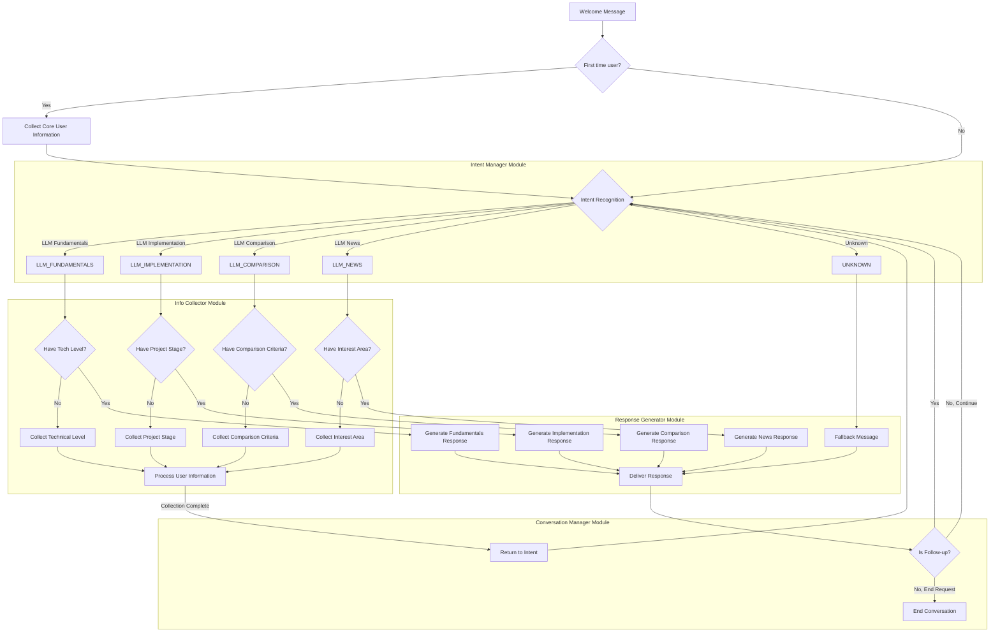

# LexiLLM: Large Language Model Assistant
## Complete Technical Documentation

## 1. Project Overview

LexiLLM is a specialized chatbot designed to assist users with understanding and implementing Large Language Models (LLMs). The bot provides expert guidance on LLM fundamentals, implementation strategies, model comparisons, and recent developments in the field.

### 1.1 Key Features

- **Intent-Driven Responses**: Identifies user questions about LLM fundamentals, implementation guidance, model comparisons, and industry news
- **User Profile Management**: Creates and maintains comprehensive user profiles with confidence scoring
- **Personalized Responses**: Tailors content based on user's technical level and interests
- **Natural Onboarding**: Progressively collects user preferences without disrupting conversation flow
- **Multi-Platform Support**: Command-line and Streamlit web interfaces with real-time streaming responses
- **Persistent Memory**: Maintains user preferences across sessions for consistent experiences

## 2. Technical Architecture

LexiLLM uses a modular architecture with clearly separated components for improved maintainability and testability:

```
LexiLLM/
├── src/
│   ├── lexillm/                 # Core Package
│   │   ├── __init__.py          # Package initialization
│   │   ├── bot.py               # Main bot implementation (orchestrator)
│   │   ├── config.py            # Configuration settings
│   │   ├── exceptions.py        # Custom exception classes
│   │   ├── logger.py            # Logging configuration
│   │   ├── schemas.py           # Data schemas using Pydantic
│   │   ├── templates.py         # Prompt templates
│   │   ├── user_profile.py      # User profile management
│   │   ├── utils.py             # Utility functions
│   │   └── modules/             # Modular components
│   │       ├── __init__.py      # Module initialization
│   │       ├── conversation_manager.py  # Manages conversation flow & state
│   │       ├── conversation_state.py    # State enumeration and checks
│   │       ├── info_collector.py        # User information collection
│   │       ├── intent_manager.py        # Intent classification
│   │       └── response_generator.py    # Response generation
│   ├── ui/                      # UI Components
│   │   ├── __init__.py          # UI package initialization
│   │   ├── components.py        # UI component definitions
│   │   ├── image_utils.py       # Image handling utilities
│   │   ├── state.py             # Streamlit state management
│   │   └── styling.py           # CSS styling for UI
│   ├── main.py                  # CLI entry point
│   └── ui_streamlit_enhanced.py # Streamlit UI implementation
└── user_profiles/               # Storage for user profiles
```

### 2.1 Core Components

1. **LexiLLM Class (`bot.py`)**: Central orchestrator that coordinates the modules and manages the conversation flow. It delegates specific functionality to the specialized modules rather than implementing them directly.

2. **Intent Manager (`intent_manager.py`)**: Responsible for intent classification using LangChain structured output. It determines user's intent, handles follow-up detection, and manages confidence thresholds.

3. **Info Collector (`info_collector.py`)**: Manages collection of user information, both explicitly through direct questions and implicitly through natural conversation analysis.

4. **Response Generator (`response_generator.py`)**: Creates personalized responses using LangChain templates, supporting both standard and streaming responses based on user profile attributes.

5. **Conversation Manager (`conversation_manager.py`)**: Maintains conversation state, history, and handles transitions between different conversation states.

6. **User Profile Management (`user_profile.py`)**: Handles creation, persistence, and updating of user profiles with confidence scoring.

### 2.2 Benefits of Modular Architecture

The refactored modular architecture provides several key benefits:

- **Improved Maintainability**: Each module has a clear responsibility, making it easier to update or fix specific components without affecting others.

- **Enhanced Testability**: Modules can be tested independently, improving test coverage and reliability.

- **Better Code Organization**: The codebase is logically organized with clear separation of concerns.

- **Reduced Complexity**: The main `LexiLLM` class is simpler, focusing on orchestration rather than implementation details.

- **Easier Extension**: New features can be added to specific modules without changing the entire system.

## 3. User Profile System

### 3.1 Components

- **ProfileAttribute**: Represents a single piece of user information with confidence scores and metadata
- **UserProfile**: Comprehensive user profile with information collected throughout conversations
- **UserProfileManager**: Handles persistence, extraction, and collection of user information

### 3.2 Key Profile Attributes

- **Basic Information**: name, preferred_name
- **Technical Background**: technical_level, background, experience_with_llms
- **Project Details**: project_stage, project_goal, industry
- **Preferences**: comparison_criterion, interest_area, communication_style, depth_preference
- **Session Information**: interaction history, topic history, onboarding status

### 3.3 Information Collection

- **Explicit Collection**: Direct questions during onboarding and conversation
- **Implicit Extraction**: Pattern-based extraction from natural conversation
- **Confidence Scoring**: Each attribute has a confidence score (0.0-1.0) and source
- **Progressive Collection**: Core attributes collected during onboarding, advanced attributes later

## 4. Conversation Flow

The modular architecture enables a sophisticated conversation flow with clear separation of responsibilities:



### 4.1 Conversation Stages

1. **Welcome & Onboarding**: First-time users go through a natural onboarding process
2. **Intent Classification**: User messages are classified into specific intents
3. **Information Collection**: If needed, user information is collected for personalization
4. **Response Generation**: Personalized responses are generated based on intent and user profile
5. **Follow-up Detection**: System detects if messages are follow-ups to previous questions
6. **Opportunity Detection**: System looks for natural opportunities to collect more information
7. **End Detection**: System recognizes when the user wants to end the conversation

## 5. Intent Recognition System

### 5.1 Intent Categories

LexiLLM recognizes four primary intents plus a fallback:

1. **LLM_FUNDAMENTALS**: Questions about how LLMs work, architecture, training, etc.
2. **LLM_IMPLEMENTATION**: Questions about implementing, fine-tuning, or deploying LLMs
3. **LLM_COMPARISON**: Questions comparing different models or selecting appropriate models
4. **LLM_NEWS**: Questions about recent developments or future directions
5. **UNKNOWN**: Fallback for unrecognized queries

### 5.2 Classification Methodology

- Uses LangChain's structured output with a Pydantic schema for classification
- Returns both intent and confidence score
- Includes follow-up detection using rules-based and LLM-based methods
- Manages confidence thresholds for more reliable classification

## 6. Response Generation

### 6.1 Personalization Dimensions

- **Technical Level**: Beginner, Intermediate, Advanced
- **Project Stage**: Planning, Development, Optimization
- **Comparison Criteria**: Accuracy, Speed, Cost
- **Interest Areas**: Research, Applications

### 6.2 Response Templates

- Each intent has a dedicated prompt template using LangChain
- Templates include personalization variables from user profile
- Both standard and streaming response generation is supported
- Templates handle fallback and end-conversation scenarios

## 7. Web Interface

The Streamlit-based web interface provides an intuitive user experience:

### 7.1 UI Features

- **Category Cards**: Visual representation of different LLM topics
- **Real-time Streaming**: Character-by-character display with typing indicator
- **Visual Categorization**: Color-coded responses based on intent
- **Response Timing**: Display of response generation time
- **Session Management**: Persistence of conversation across page refreshes
- **Error Handling**: User-friendly error messages
- **Mobile Responsiveness**: Adapts to different screen sizes

### 7.2 UI Components

- **Header**: App title and logo
- **Category Cards**: Topic overview cards
- **Chat Container**: Message display with styling
- **Sidebar**: About information, help, and reset button
- **Input Area**: User input with processing state

## 8. Error Handling

LexiLLM implements comprehensive error handling:

- **Custom Exception Classes**: Specific exception types for different error scenarios
- **Graceful Degradation**: Fallback to simpler responses when errors occur
- **Logging**: Detailed logging of errors for troubleshooting
- **User-Friendly Messages**: Clear error messages that don't expose technical details
- **Recovery Mechanisms**: Ability to continue conversation after errors

## 9. Installation and Usage

### 9.1 Prerequisites

- Python 3.8+
- OpenAI API key

### 9.2 Installation

```bash
# Clone the repository
git clone https://github.com/username/LexiLLM.git
cd LexiLLM

# Create a virtual environment
python -m venv .venv
source .venv/bin/activate  # On Windows: .venv\Scripts\activate

# Install dependencies
pip install -r requirements.txt

# Set up OpenAI API key in .env file
echo "OPENAI_API_KEY=your_api_key_here" > .env
```

### 9.3 Running the Bot

```bash
# Run the Streamlit UI
./run_ui.sh

# Run the CLI version
./run.sh

# Run with custom parameters
python src/main.py --model gpt-4o --no-color
```

### 9.4 Interface Options

- **Web Interface**: Streamlit-based UI with streaming responses
- **Command Line**: Terminal-based interface with colored output
- **API Usage**: Import the LexiLLM class directly in Python code

## 10. Testing Approach

LexiLLM has a comprehensive testing strategy that leverages the modular architecture:

### 10.1 Test Categories

- **Unit Tests**: Testing individual components and modules in isolation
  - Intent classification accuracy
  - User profile updating and retrieval
  - Response generation with different user profiles
  - Conversation state transitions

- **Integration Tests**: Testing interactions between modules
  - End-to-end conversation flows
  - State transitions during complex interactions
  - Profile persistence and loading

- **Edge Case Tests**:
  - Error handling when API is unavailable
  - Recovery from interrupted conversations
  - Handling of unusual or ambiguous inputs

### 10.2 Test Execution

Tests can be run using the provided script:

```bash
./run_tests.sh
```

## 11. Future Enhancements

Potential areas for future development:

- **Multi-LLM Support**: Integration with different LLM providers
- **Voice Interface**: Speech-to-text and text-to-speech capabilities
- **Knowledge Base Integration**: Connection to documentation and resources
- **Analytics Dashboard**: Usage statistics and conversation analytics
- **Collaborative Features**: Shared conversations and team workspaces
- **Extensible Plugin System**: Allow for custom capabilities and integrations

## 12. Example Conversations

### 12.1 LLM Fundamentals Example

```
User: How do transformer models work?
LexiLLM: Before I explain, could you tell me your level of technical expertise with LLMs? (Beginner/Intermediate/Advanced)
User: Beginner
LexiLLM: Thanks for sharing that! I'll explain transformers in a beginner-friendly way.

Transformer models are like super-powerful text processing engines. Imagine you're reading a sentence - your brain naturally connects words that go together, even if they're far apart. Transformers do this through a mechanism called "attention."

The key breakthrough of transformers is this attention mechanism, which allows the model to focus on different words depending on context. For example, in "The cat sat on the mat because it was comfortable," a transformer can understand that "it" refers to "the mat," not "the cat."

Transformers process text in parallel (not word-by-word like older models), making them much faster to train. They're built with two main parts: an encoder (which understands input) and a decoder (which generates output).

Would you like me to explain any specific part of transformers in more detail?
```

### 12.2 LLM Implementation Example

```
User: I want to build a chatbot for my e-commerce site
LexiLLM: I'd be happy to help with that! To provide the most relevant guidance for your e-commerce chatbot, could you tell me what stage you're at with this project? (Planning/Development/Optimization)
User: Planning, just getting started
LexiLLM: Thanks for letting me know you're in the planning stage for your e-commerce chatbot! Here's a structured approach to get you started:

1. Define Your Scope:
   • Customer service (returns, shipping questions)
   • Product recommendations
   • Order tracking
   • Inventory questions
   • General FAQs

2. Choose Your Implementation Approach:
   • API-based (OpenAI, Anthropic, etc.)
   • Open-source model (hosted yourself)
   • Hybrid approach with multiple models

3. Consider This Basic Architecture:
   • Frontend chat interface on your website
   • Backend LLM integration
   • Knowledge base with your product and policy information
   • Retrieval-Augmented Generation (RAG) to provide accurate answers

4. Don't Forget Safety Guardrails:
   • Content filtering
   • Fallback to human support when needed
   • Clear disclaimers about AI assistance

Would you like me to elaborate on any of these areas or discuss specific LLM options for e-commerce chatbots?
```

## 13. Evaluation and Performance

### 13.1 Evaluation Metrics

- **Intent Classification Accuracy**: Percentage of correctly classified intents
- **User Satisfaction**: Measured through feedback and interaction patterns
- **Conversation Coherence**: Consistency across multi-turn conversations
- **Error Recovery**: Ability to recover from misunderstandings
- **Response Time**: Performance metrics for response generation

### 13.2 Performance Considerations

- **Streaming Optimization**: Real-time response streaming for better user experience
- **History Management**: Automatic pruning of conversation history to maintain performance
- **Caching**: Strategic caching of common responses for improved latency
- **Error Rate Monitoring**: Tracking of classification errors to identify improvement areas

---

*Developed by Uday Kiran Dasari*  
*Northeastern University*  
*Prompt Engineering - Spring 2025*