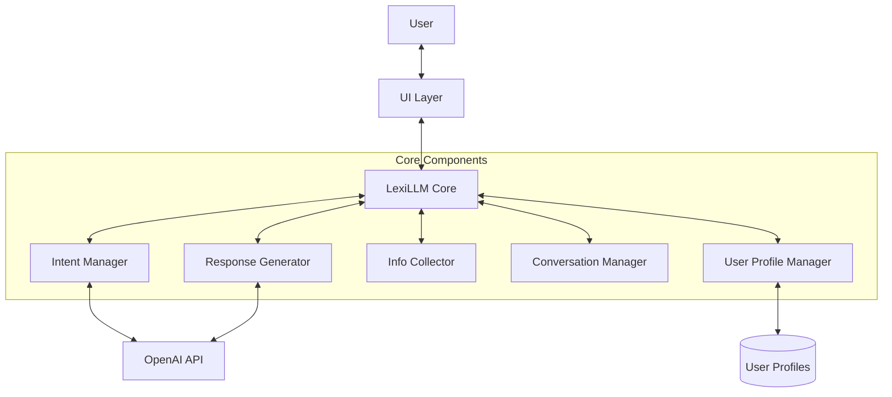
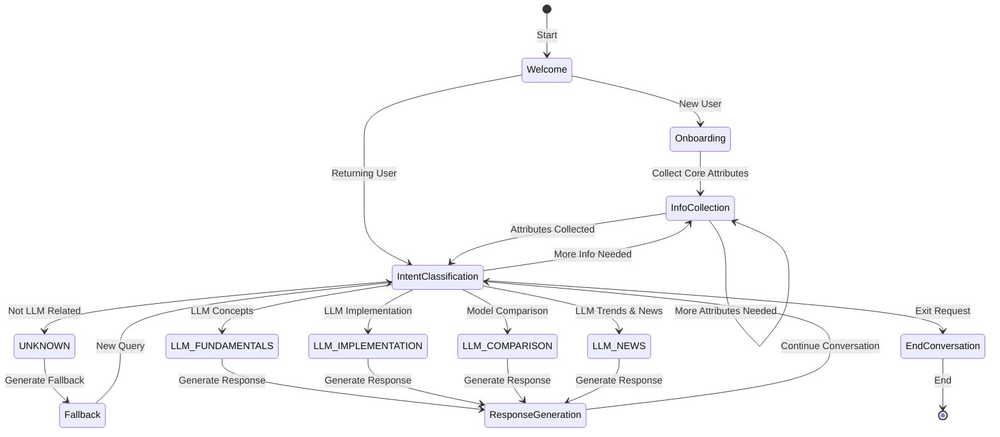

# LexiLLM Technical Documentation

This document provides a comprehensive technical overview of the LexiLLM chatbot architecture, components, and implementation details.

## Table of Contents
- [System Architecture](#system-architecture)
- [Core Components](#core-components)
- [Intent Classification System](#intent-classification-system)
- [User Profile Management](#user-profile-management)
- [Conversation Flow](#conversation-flow)
- [Response Generation](#response-generation)
- [Prompt Engineering](#prompt-engineering)
- [Error Handling & Fallbacks](#error-handling--fallbacks)
- [UI Implementation](#ui-implementation)
- [Testing](#testing)
- [Configuration](#configuration)

## System Architecture

LexiLLM follows a modular architecture designed around specialized components for different aspects of the conversation.

### High-Level Architecture



### Data Flow

1. User inputs a message through the UI layer (CLI or Streamlit)
2. The message is passed to the LexiLLM core class
3. Intent Manager classifies the user's intent
4. Info Collector extracts user information or prompts for more
5. Conversation Manager tracks the state and history
6. Response Generator produces the appropriate response
7. User Profile Manager persists user information across sessions

### Module Interactions

- **LexiLLM Core** coordinates all components and manages the conversation lifecycle
- **Intent Manager** determines the user's intent and provides confidence scores
- **Response Generator** creates appropriate responses based on intent and user profile
- **Info Collector** gathers and maintains user information for personalization
- **Conversation Manager** maintains conversation state and handles transitions
- **User Profile Manager** persists user profiles across sessions

## Core Components

### LexiLLM Core (`lexillm.py`)

The LexiLLM class is the main entry point and coordination layer. It:

- Initializes all components and manages their interactions
- Processes user messages (both standard and streaming)
- Handles welcome and end conversation states
- Manages the conversation lifecycle
- Provides external interfaces for CLI and UI integration

Key methods:
- `process_message(message: str) -> str`: Process a single user message
- `process_message_streaming(message: str) -> Iterator[str]`: Process with streaming response
- `welcome_message() -> str`: Generate the initial welcome message
- `is_conversation_active() -> bool`: Check if the conversation is still active

### Intent Manager (`modules/intent_manager.py`)

The Intent Manager is responsible for determining what the user is asking about. It:

- Classifies user queries into one of 5 intents (4 LLM-specific + UNKNOWN)
- Provides confidence scores for classifications
- Determines if a message is a follow-up to previous conversation
- Checks domain relevance to filter out non-LLM topics
- Suggests related topics for fallback responses

Key methods:
- `classify_intent(query: str) -> Dict[str, Any]`: Determine the user's intent
- `check_domain_relevance(query: str) -> DomainRelevance`: Check if query is LLM-related
- `is_followup_question(message: str, chat_history) -> bool`: Detect follow-up questions

Intents supported:
- `LLM_FUNDAMENTALS`: Questions about LLM concepts, architecture, theory
- `LLM_IMPLEMENTATION`: Questions about implementing, fine-tuning, prompting
- `LLM_COMPARISON`: Questions comparing different models or architectures
- `LLM_NEWS`: Questions about recent developments and trends
- `UNKNOWN`: Queries not related to LLMs

### Response Generator (`modules/response_generator.py`)

The Response Generator creates appropriate responses based on intent and user profile. It:

- Selects the appropriate response template based on intent
- Personalizes responses with user profile information
- Handles both standard and streaming response generation
- Generates fallback messages for unrecognized intents
- Creates end conversation messages

Key methods:
- `generate_response(query: str, intent: str, chat_history, user_profile, specific_topic: str) -> str`: Generate standard response
- `generate_response_streaming(query: str, intent: str, chat_history, user_profile, specific_topic: str) -> Iterator[str]`: Generate streaming response
- `generate_fallback_message(query: str, chat_history) -> str`: Generate fallback for unrecognized intents
- `end_conversation(chat_history, user_profile) -> str`: Generate conversation ending message

### Info Collector (`modules/info_collector.py`)

The Info Collector manages user information throughout the conversation. It:

- Determines when to collect user information
- Generates questions to collect specific attributes
- Processes responses to information collection questions
- Extracts user information implicitly from messages
- Tracks onboarding state for new users

Key methods:
- `check_for_info_collection_opportunity() -> Tuple[bool, Optional[str]]`: Check when to collect info
- `process_explicit_info_collection(message: str) -> Optional[str]`: Process info collection response
- `extract_user_info_from_message(message: str) -> List[Tuple[str, Any]]`: Extract implicit info
- `is_in_onboarding() -> bool`: Check if user is in onboarding process

### User Profile Manager (`user_profile.py`)

The User Profile Manager handles persistent user profiles. It:

- Creates, loads, and saves user profiles
- Manages profile attributes with confidence scores
- Normalizes user responses for specific attributes
- Generates personalized collection messages
- Extracts user information from messages

Key classes:
- `UserProfile`: Represents a user with multiple attributes and metadata
- `ProfileAttribute`: Represents a single user attribute with confidence and source
- `UserProfileManager`: Manages persistence and retrieval of profiles

Data structures:
- Each attribute has a value, confidence score (0.0-1.0), timestamp, and source
- Core attributes: name, technical_level, interest_area
- Advanced attributes: project_stage, comparison_criterion, depth_preference
- Profile tracks interaction count, first/last interaction, and topic history

### Conversation Manager (`modules/conversation_manager.py`)

The Conversation Manager maintains the state of the conversation. It:

- Tracks the current conversation state
- Manages the chat history with trimming for context management
- Handles state transitions between different conversation phases
- Records pending queries when collecting information
- Manages confirmation flows

States supported:
- `IDLE`: Default state when waiting for user input
- `ONBOARDING`: Collecting initial user information
- `INFO_COLLECTION`: Collecting specific user information
- `PROCESSING`: Processing a user message
- `RESPONDING`: Generating a response
- `AWAITING_CONFIRMATION`: Waiting for user confirmation
- `ENDING`: Ending the conversation

## Intent Classification System

LexiLLM uses a sophisticated intent classification system based on LangChain and LLM function calling.

### Classification Process

1. First, check if the query is related to LLMs using the domain relevance prompt
2. If LLM-related, classify into one of the 4 specific intents using the intent classification prompt
3. Provide confidence scores for the classification
4. Track recent intents for context-aware classification

### Prompt Design

The intent classification uses structured output with Pydantic models:

```python
class IntentClassifier(BaseModel):
    intent: Literal["LLM_FUNDAMENTALS", "LLM_IMPLEMENTATION", "LLM_COMPARISON", "LLM_NEWS", "UNKNOWN"]
    confidence: float
    reasoning: str
    topics: list
```

### Confidence Scoring

- High confidence (0.85-1.0): Clearly about the classified intent
- Medium confidence (0.7-0.85): Reasonably clear but could fit multiple categories
- Low confidence (0.5-0.7): Somewhat unclear but best fit
- Very low confidence (<0.5): Ambiguous or unrelated to LLMs

### Domain Relevance

Before classifying intent, LexiLLM checks if the query is related to LLMs:

```python
class DomainRelevance(BaseModel):
    is_relevant: bool
    confidence: float
    related_topics: list
    reasoning: str
```

This helps filter out completely unrelated queries and directs them to the fallback flow.

## User Profile Management

LexiLLM maintains persistent user profiles to personalize responses.

### Profile Attributes

Each attribute has:
- `value`: The actual attribute value
- `confidence`: Confidence score (0.0-1.0) 
- `last_updated`: Timestamp of last update
- `source`: How it was obtained (explicit, implicit, default)

### Information Collection

Information is collected through:

1. **Explicit Collection**: Directly asking the user for specific information
2. **Implicit Collection**: Extracting information from user messages
3. **Onboarding**: Initial collection of core attributes for new users

### Attribute Normalization

User responses are normalized through pattern matching:

```python
def normalize_response(self, attribute: str, value: str) -> Any:
    if attribute == "technical_level":
        value = value.lower()
        if "begin" in value or "new" in value:
            return "beginner"
        elif "inter" in value or "some" in value:
            return "intermediate"
        # ...and so on
```

### Persistence

Profiles are saved as JSON files in the `user_profiles` directory:

```python
def save_to_file(self, directory: str = "user_profiles") -> None:
    os.makedirs(directory, exist_ok=True)
    filename = os.path.join(directory, f"{self.user_id}.json")
    with open(filename, 'w') as f:
        json.dump(self.to_dict(), f, cls=UserProfileEncoder)
```

## Conversation Flow

The conversation flow in LexiLLM is managed through state transitions and context tracking.

### Conversation States



### Context Management

LexiLLM maintains chat history for context, but with limitations:

- Maximum history pairs to avoid context overflow
- Preservation of initial messages for continuity
- Trimming middle messages when history grows too large

This allows for maintaining context while managing token usage.

### Follow-up Detection

Follow-up questions are detected through:

1. **LLM-based detection**: Analyzing if the current message refers to previous context
2. **Heuristic fallbacks**: Short messages, questions, pronoun usage
3. **Timeout management**: Fallback to heuristics if LLM detection times out

## Response Generation

LexiLLM generates responses based on intent and user profile information.

### Template System

Each intent has its own specialized prompt template:

```python
"LLM_FUNDAMENTALS": ChatPromptTemplate.from_messages([
    ("system", """You are LexiLLM, a specialized assistant for Large Language Models.
    You explain LLM concepts with clarity and accuracy.
    
    The user has a {technical_level} level of expertise with LLMs.
    
    If beginner: Use analogies, avoid jargon, focus on building intuition.
    If intermediate: Balance technical details with clear explanations.
    If advanced: Provide in-depth technical explanations with architecture specifics.
    
    IMPORTANT: The user wants to know about "{specific_topic}". Make sure to directly address this topic in your response.
    
    Always be educational and helpful, citing specific research or implementations
    where relevant to add credibility to your explanations.
    
    End your response with a follow-up question related to the topic AND ask if they want to continue or end the conversation.
    """),
    MessagesPlaceholder(variable_name="chat_history"),
    ("human", "{query}")
])
```

### Personalization

Responses are personalized based on user profile:

- **Technical Level**: Adjusts explanation complexity (beginner/intermediate/advanced)
- **Project Stage**: Tailors implementation advice (planning/development/optimization)
- **Comparison Criterion**: Focuses on what matters to the user (accuracy/speed/cost)
- **Interest Area**: Emphasizes research or applications based on preference

### Streaming Implementation

LexiLLM supports streaming responses to enhance the user experience:

```python
def generate_response_streaming(self, query: str, intent: str, chat_history, user_profile,
                               specific_topic: Optional[str] = None, 
                               matched_keywords: List[str] = None) -> Iterator[str]:
    # ...
    for chunk in chain.stream(variables):
        if isinstance(chunk, AIMessageChunk):
            chunk_text = chunk.content
            
            if is_first_chunk:
                # Process the first chunk specially to remove labels
                # ...
            else:
                complete_response += chunk_text
                yield chunk_text
    # ...
```

## Prompt Engineering

LexiLLM uses carefully crafted prompts for different aspects of the conversation. Here are the key prompt design patterns used:

### Intent Classification Prompt

The intent classification prompt is designed to:
- Clearly define the different intent categories
- Explain what each intent means and when to use it
- Provide guidance on confidence scoring
- Emphasize semantic understanding over keyword matching
- Include examples to illustrate correct classification

```python
def create_intent_prompt():
    return ChatPromptTemplate.from_messages([
        ("system", """You are LexiLLM, a specialized assistant ONLY for Large Language Models (LLMs) and related AI topics.
        
        Your task is to analyze the user's query and determine if it's related to Large Language Models (LLMs) and, if so, what specific aspect of LLMs they're asking about.
        
        STEP 1: Determine if the query is related to LLMs or closely associated AI technologies.
        Consider the query semantically - don't just look for keywords, but understand the meaning and context.
        
        LLM-related topics include (but are not limited to):
        - LLM architectures, training, and optimization
        - Natural language processing with LLMs
        - Transformer models, attention mechanisms
        - Tokenization, embeddings, vector representations
        - Prompt engineering and in-context learning
        - Fine-tuning and adaptation techniques
        - Neural networks and deep learning as applied to language models
        - Vector databases and retrieval methods used with LLMs
        - LLM researchers, companies, and developers
        - LLM applications, products, and services
        - Ethical considerations specific to LLMs
        
        STEP 2: If the query IS related to LLMs, classify it into one of these intents:
        ...
        """),
        ("human", "{query}")
    ])
```

### Domain Relevance Prompt

The domain relevance prompt helps determine if a query is LLM-related:
- Defines LLM-related domains and topics clearly
- Provides examples of related vs. unrelated queries
- Emphasizes semantic understanding
- Requires structured output with reasoning

This prompt applies a first-level filter to ensure the bot stays within its domain of expertise.

### Response Generation Prompts

Each intent has a specialized response template with:

1. **Context-setting**: Explaining the bot's persona and role
2. **User personalization**: Including variables like `technical_level` and `interest_area`
3. **Topic focusing**: Directing attention to the `specific_topic`
4. **Formatting guidance**: Instructions on response structure and ending
5. **Chat history inclusion**: Access to previous messages for context

### Information Collection Prompts

The extraction prompt is designed to:
- Extract information from user messages implicitly
- Look for both explicit statements and contextual clues
- Handle ambiguity appropriately
- Extract only what's actually present in the message

```python
def create_extraction_prompt():
    return ChatPromptTemplate.from_messages([
        ("system", """You are LexiLLM, a specialized assistant for LLMs.
        
        Carefully analyze the user's message to extract relevant information about them that could help personalize responses.
        Look for both explicit statements and implicit clues about:
        
        1. Name: Any name they refer to themselves by
        2. Technical level: Their expertise with LLMs (beginner, intermediate, advanced)
           - Beginners often ask basic questions, use simpler vocabulary, or explicitly state they're new
           - Intermediate users understand core concepts but may need help with implementation
           - Advanced users typically use technical terminology, ask specific questions, or mention working with LLMs
        ...
        """),
        ("human", "{query}")
    ])
```

### Prompt Variables

Prompts are dynamically configured with variables:
- `technical_level`: Beginner, intermediate, or advanced
- `project_stage`: Planning, development, or optimization
- `comparison_criterion`: Accuracy, speed, or cost
- `interest_area`: Research or applications
- `specific_topic`: The focused subject of the query
- `name`: User's name for personalization

These variables are sourced from the user profile and used to personalize prompts.

### Prompt Chaining

LexiLLM uses LangChain's chaining capabilities to combine prompts with models and output parsers:

```python
# Intent classification using structured output
self.intent_chain = self.intent_prompt | self.classifier_llm.with_structured_output(
    IntentClassifier,
    method="function_calling"
)

# Response generation
template = self.response_templates[intent]
chain = template | self.llm | StrOutputParser()
response = chain.invoke(variables)
```

This allows for structured handling of different conversation stages with the appropriate prompt designs.

## Error Handling & Fallbacks

LexiLLM implements comprehensive error handling throughout the codebase.

### Exception Hierarchy

A specialized exception hierarchy allows for precise error handling:

```python
class LexiLLMError(Exception):
    """Base class for all LexiLLM exceptions."""
    pass

class APIKeyError(LexiLLMError):
    """Raised when there's an issue with the API key."""
    pass

class ModelError(LexiLLMError):
    """Raised when there's an issue with the model."""
    pass

# ... and so on
```

### Fallback Mechanisms

Multiple fallback levels ensure graceful degradation:

1. **Intent fallback**: For uncertain intent classification, fall back to UNKNOWN
2. **Response fallback**: If normal response generation fails, use simpler templates
3. **Information extraction fallback**: If extraction fails, use default values
4. **UI fallback**: Show helpful error messages if backend issues occur

### Logging

Comprehensive logging throughout the codebase:

```python
logger = get_logger()
logger.info(f"Initializing LexiLLM with model: {self.model_name}")
```

## UI Implementation

LexiLLM provides both CLI and Streamlit web interfaces.

### CLI Interface

The CLI interface is implemented in `main.py` with two modes:

1. **Interactive mode**: Standard response generation
2. **Streaming mode**: Token-by-token response streaming

### Streamlit UI

The enhanced Streamlit UI (`ui_streamlit_enhanced.py`) provides a richer experience:

- **Category Cards**: Visual representation of main topic areas
- **Chat Container**: Message history with styling and timestamps
- **Sidebar**: About information, status indicator, and reset button
- **Responsive Design**: Works on different screen sizes

### UI Components

Key UI components:

1. **Header**: Logo and title
2. **Category Cards**: Visual menu of main topics
3. **Chat Messages**: Styled message containers with role icons
4. **Input Area**: Text input with send button
5. **Sidebar**: Auxiliary information and controls

### State Management

Streamlit state management for maintaining conversation:

```python
if "messages" not in st.session_state:
    st.session_state.messages = []
    
if "bot" not in st.session_state:
    api_key = os.environ.get("OPENAI_API_KEY")
    session_id = st.session_state.get("session_id", str(uuid.uuid4()))
    st.session_state.bot = LexiLLM(api_key=api_key, session_id=session_id)
```

### Styling

Custom styling enhances the visual appeal:

```python
st.markdown("""
<style>
.category-card {
    padding: 10px;
    border-radius: 10px;
    border: 1px solid #e9ecef;
    height: 100%;
    background-color: #f8f9fa;
}
.category-card.fundamentals {
    background-color: #cfe2ff;
    border-color: #9ec5fe;
}
/* ... additional styling ... */
</style>
""", unsafe_allow_html=True)
```

## Testing

LexiLLM has a comprehensive test suite in the `tests` directory.

### Test Architecture

- **Unit Tests**: For individual components 
- **Integration Tests**: For component interactions
- **End-to-End Tests**: For complete conversation flows

Key test files:
- `test_lexillm.py`: Tests for the core LexiLLM class
- `test_modules.py`: Tests for all modules
- `test_schemas.py`: Tests for data validation
- `test_templates.py`: Tests for prompt templates

## Configuration

LexiLLM uses a centralized configuration in `config.py`:

```python
# LLM Configuration
LLM_CONFIG = {
    "default_model": os.environ.get("LEXILLM_MODEL", "gpt-4o"),
    "fallback_model": os.environ.get("LEXILLM_FALLBACK_MODEL", "gpt-3.5-turbo"),
    # ... additional configuration options
}

# Conversation Management Configuration
CONVERSATION_CONFIG = {
    "max_history_pairs": int(os.environ.get("LEXILLM_MAX_HISTORY_PAIRS", "10")),
    # ... additional configuration options
}

# ... other configuration sections
```

This allows for easy adjustment of parameters without changing code throughout the application.

## Extensibility & Future Development

LexiLLM is designed for extensibility in several key areas:

### Adding New Intents

To add a new intent:
1. Add the intent to the `IntentClassifier` schema
2. Update the intent classification prompt to include the new intent
3. Create a response template for the new intent
4. Register the template in the `create_templates()` function

### Supporting New LLM Providers

The architecture supports adding new LLM providers:
1. Create a new LLM wrapper class or use LangChain's built-in support
2. Update the configuration with provider-specific settings
3. Initialize the alternative LLM in the LexiLLM constructor

### Enhancing User Profiles

The user profile system can be extended with:
1. New attributes in the `UserProfile` class
2. Extraction methods in `UserProfileManager`
3. Updated response templates that leverage the new attributes

### UI Enhancements

The UI can be enhanced with:
1. New components in the `ui/components.py` file
2. Additional styling in `ui/styling.py`
3. Extended state management in `ui/state.py`
